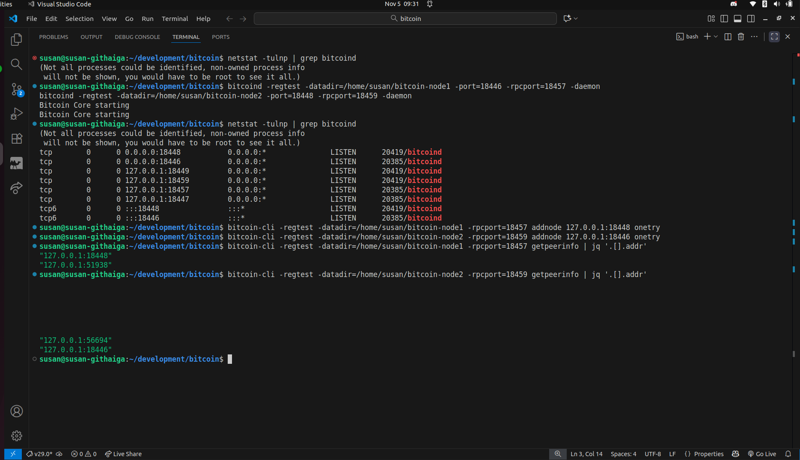

## Running Multiple Nodes (Simulated Network)

### Step 1: Start Second Node
*Output:*

#### i) Create node
```bash
susan@susan-githaiga:~/development/bitcoin$ mkdir -p ~/bitcoin-node1
susan@susan-githaiga:~/development/bitcoin$ mkdir -p ~/bitcoin-node2
susan@susan-githaiga:~/development/bitcoin$ cd -
/home/susan
susan@susan-githaiga:~$ ls
bitcoin-node1  demo     development  Downloads  Pictures  snap       Videos
bitcoin-node2  Desktop  Documents    Music      Public    Templates
```
#### ii) Start nodes

**node 1**
```bash
susan@susan-githaiga:~/development/bitcoin/build/bin$ bitcoind -regtest -datadir=/home/susan/bitcoin-node1 -port=18446 -rpcport=18457 -daemon
Bitcoin Core starting
```
<br>

**node 2**
```bash
susan@susan-githaiga:~/development/bitcoin/build/bin$ bitcoind -regtest -datadir=/home/susan/bitcoin-node2 -port=18448 -rpcport=18459 -daemon
Bitcoin Core starting
```
<br>

---
### Step 2: Connect Nodes

#### Connect node1 → node2

```bash
susan@susan-githaiga:~/development/bitcoin$ bitcoin-cli -regtest -datadir=/home/susan/bitcoin-node1 -rpcport=18457 addnode 127.0.0.1:18448 onetry
```

#### Connect node2 → node1

```bash
susan@susan-githaiga:~/development/bitcoin$ bitcoin-cli -regtest -datadir=/home/susan/bitcoin-node2 -rpcport=18459 addnode 127.0.0.1:18446 onetry
```
<br>

---

### Step 3: Verify Connection

#### i) Verify peers from node1

```bash
susan@susan-githaiga:~/development/bitcoin$ bitcoin-cli -regtest -datadir=/home/susan/bitcoin-node1 -rpcport=18457 getpeerinfo | jq '.[].addr'
"127.0.0.1:18448"
"127.0.0.1:51938"
```

#### ii) Verify peers from node2

```bash
susan@susan-githaiga:~/development/bitcoin$ bitcoin-cli -regtest -datadir=/home/susan/bitcoin-node2 -rpcport=18459 getpeerinfo | jq '.[].addr'
"127.0.0.1:56694"
"127.0.0.1:18446"
```




<br>

---