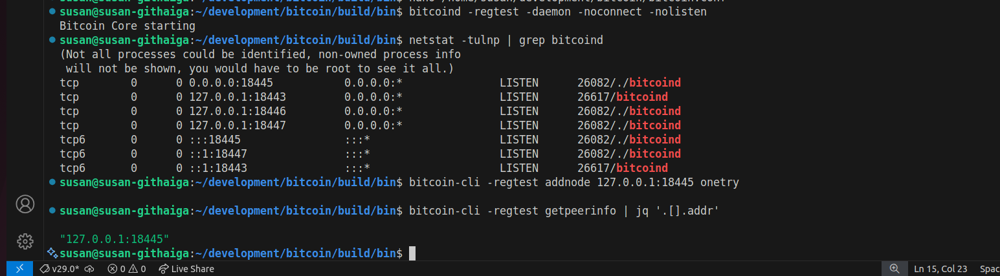

## Running Multiple Nodes (Simulated Network)

### Step 1: Start Second Node
*Output:*

#### i) Create node
```bash
susan@susan-githaiga:~/development/bitcoin$ mkdir -p ~/bitcoin-node2
susan@susan-githaiga:~/development/bitcoin$ cd -
/home/susan
susan@susan-githaiga:~$ ls
bitcoin-node2  development  Downloads  Pictures  snap       Videos
Desktop        Documents    Music      Public    Templates
```
#### ii) Start node
```bash
susan@susan-githaiga:~/development/bitcoin/build/bin$ ./bitcoind -regtest -datadir=/home/susan/bitcoin-node2 -port=18445 -rpcport=18447 -daemon
Bitcoin Core starting
```
<br>

---

### Step 2: Connect Nodes

*Output:*

```bash
susan@susan-githaiga:~/development/bitcoin/build/bin$ bitcoin-cli -regtest addnode 127.0.0.1:18445 onetry
```
<br>

---

### Step 3: Verify Connection

*Output:*

