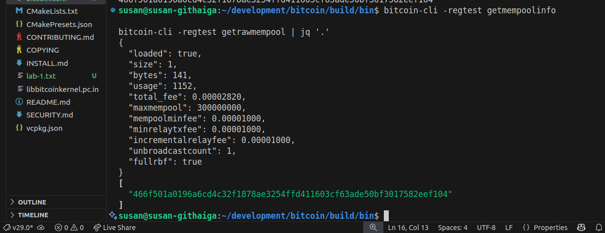
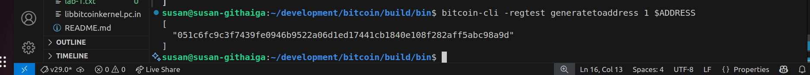
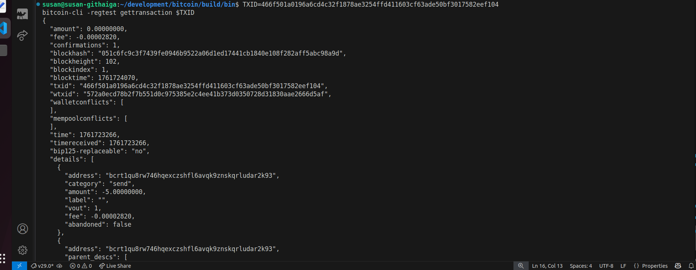

## Transaction Propagation and the Mempool

### Step 1: Send a Transaction

```bash
RECV_ADDR=$(bitcoin-cli -regtest getnewaddress)

bitcoin-cli -regtest sendtoaddress $RECV_ADDR 5.0
```

*Output:*


<br>

---

### Step 2: Check Mempool

```bash
bitcoin-cli -regtest getmempoolinfo

bitcoin-cli -regtest getrawmempool | jq '.'
```

*Output:*



<br>

---


### Step 3: Mine the Transaction

```bash
bitcoin-cli -regtest generatetoaddress 1 $ADDRESS
```

*Output:* 



<br>

---


### Step 4: Verify Confirmation

```bash
TXID=466f501a0196a6cd4c32f1878ae3254ffd411603cf63ade50bf3017582eef104
bitcoin-cli -regtest gettransaction $TXID

```

*Output:*



*Complete output:*
```bash
susan@susan-githaiga:~/development/bitcoin/build/bin$ TXID=466f501a0196a6cd4c32f1878ae3254ffd411603cf63ade50bf3017582eef104
bitcoin-cli -regtest gettransaction $TXID
{
  "amount": 0.00000000,
  "fee": -0.00002820,
  "confirmations": 1,
  "blockhash": "051c6fc9c3f7439fe0946b9522a06d1ed17441cb1840e108f282aff5abc98a9d",
  "blockheight": 102,
  "blockindex": 1,
  "blocktime": 1761724070,
  "txid": "466f501a0196a6cd4c32f1878ae3254ffd411603cf63ade50bf3017582eef104",
  "wtxid": "572a0ecd78b2f7b551d0c975385e2c4ee41b373d0350728d31830aae2666d5af",
  "walletconflicts": [
  ],
  "mempoolconflicts": [
  ],
  "time": 1761723266,
  "timereceived": 1761723266,
  "bip125-replaceable": "no",
  "details": [
    {
      "address": "bcrt1qu8rw746hqexczshfl6avqk9znskqrludar2k93",
      "category": "send",
      "amount": -5.00000000,
      "label": "",
      "vout": 1,
      "fee": -0.00002820,
      "abandoned": false
    },
    {
      "address": "bcrt1qu8rw746hqexczshfl6avqk9znskqrludar2k93",
      "parent_descs": [
        "wpkh(tpubD6NzVbkrYhZ4WmMoxDwkp4wK5uYKnyeceG6G7xsUs122bxsrMq3sttfjGDKe4C7B1H72QwuG1c9qLaGqpWzfTMFPgJA4js6Kpk4A9qEcBC2/84h/1h/0h/0/*)#6ya3t869"
      ],
      "category": "receive",
      "amount": 5.00000000,
      "label": "",
      "vout": 1,
      "abandoned": false
    }
  ],
  "hex": "02000000000101f2222b17ea89f15395699564f33001afc4d8ac1845bbf58b0d292bb8620ae0100000000000fdffffff02fc81380c01000000160014ffd37dda636a9dc0afb94bbf4596649c460f14a80065cd1d00000000160014e1c6ef5757064d8142e9febac058a29c2c01ff8d0247304402207dd0a93d7fd6fc1e716b6756be4c808f0b98395e5a59182ffe365aa58064e216022073170b4d2ab12ebe788a870a24d063955b1910c755a09d1464d81baa9a7f87e6012103883242200355065b0275be8b2aece9547bb03a9526f0e1617da58e309962850565000000",
  "lastprocessedblock": {
    "hash": "051c6fc9c3f7439fe0946b9522a06d1ed17441cb1840e108f282aff5abc98a9d",
    "height": 102
  }
}
```

