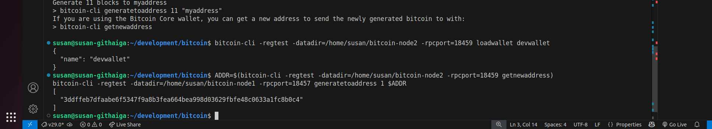
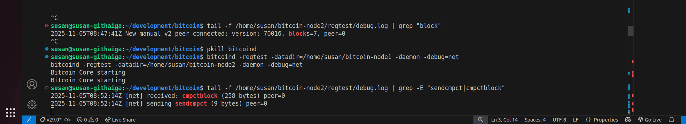

## Compact Block Relay (BIP152)

### Step 1: Enable Compact Blocks

#### i) Restart both nodes with:
```bash
bitcoind -regtest -datadir=/home/susan/bitcoin-node1 -daemon -debug=net
bitcoind -regtest -datadir=/home/susan/bitcoin-node2 -daemon -debug=net
```

#### ii) Then run:
```bash
tail -f /home/susan/bitcoin-node2/regtest/debug.log | grep -E "sendcmpct|cmpctblock"
```

#### iii) On a new terminal;
- load an existing node2 wallet
```bash
bitcoin-cli -regtest -datadir=/home/susan/bitcoin-node2 -rpcport=18459 loadwallet devwallet
```

- then mine a block by running:
```bash
ADDR=$(bitcoin-cli -regtest -datadir=/home/susan/bitcoin-node2 -rpcport=18459 getnewaddress)
bitcoin-cli -regtest -datadir=/home/susan/bitcoin-node1 -rpcport=18457 generatetoaddress 1 $ADDR
```

*Output:*


<br>

**Now, check the other terminal. The ongoing log will display the output below, showing that node2 is receiving the compact block:**

<br>

The terminal running the log command *tail -f /home/susan/bitcoin-node2/regtest/debug.log | grep -E "sendcmpct|cmpctblock"* should now show:

```bash
susan@susan-githaiga:~/development/bitcoin$ tail -f /home/susan/bitcoin-node2/regtest/debug.log | grep -E "sendcmpct|cmpctblock"
2025-11-05T08:52:14Z [net] received: cmpctblock (258 bytes) peer=0
2025-11-05T08:52:14Z [net] sending sendcmpct (9 bytes) peer=0

```

<br>

*Output:*

 <br>




