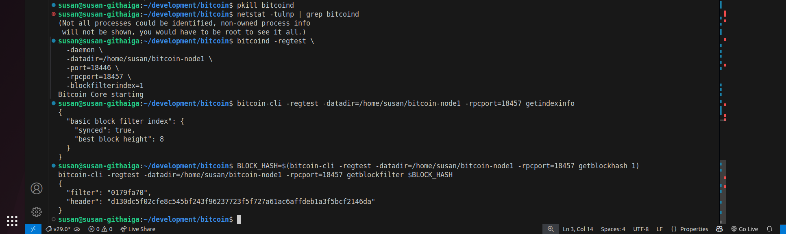

##  Compact Block Filters (BIP157/158)

### Step 1: Run a Node with Compact Filter Index

**Node used: node1**

```bash
bitcoind -regtest \
  -daemon \
  -datadir=/home/susan/bitcoin-node1 \
  -port=18446 \
  -rpcport=18457 \
  -blockfilterindex=1

```
<br>

---

### Step 2: Query Block Filter

#### i) Verify Index is Active

```bash
bitcoin-cli -regtest -datadir=/home/susan/bitcoin-node1 -rpcport=18457 getindexinfo
```

ii) Query a Block Filter
```bash
BLOCK_HASH=$(bitcoin-cli -regtest -datadir=/home/susan/bitcoin-node1 -rpcport=18457 getblockhash 1)
bitcoin-cli -regtest -datadir=/home/susan/bitcoin-node1 -rpcport=18457 getblockfilter $BLOCK_HASH
```

*Output*

<br>



<br>

---


<!-- ### Step 3: Decode Filter (Optional)

#### i) Install neutrino or btcd client to test SPV-like behavior locally. -->

