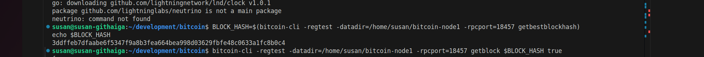
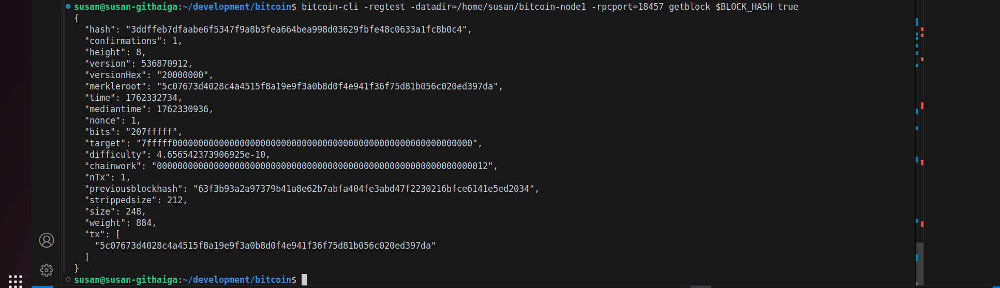
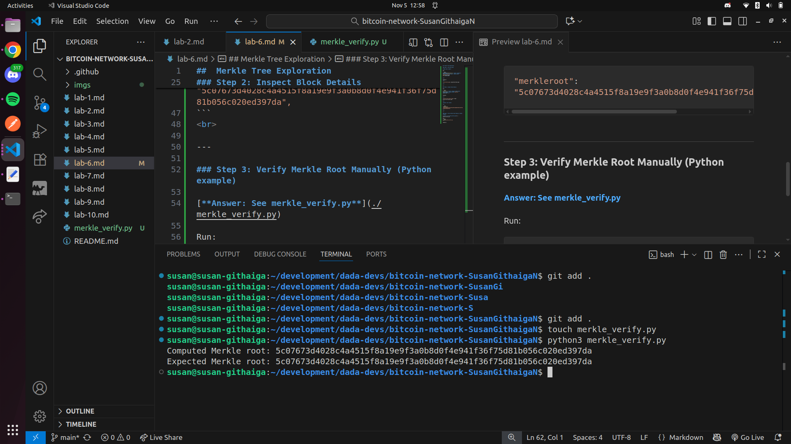

##  Merkle Tree Exploration

### Step 1: Get Block Hash

**Node used: node1**

Run:

```bash
BLOCK_HASH=$(bitcoin-cli -regtest -datadir=/home/susan/bitcoin-node1 -rpcport=18457 getbestblockhash)
echo $BLOCK_HASH

```
<br>

*Output:*
<br>



<br>

---

### Step 2: Inspect Block Details

Run: 

```bash
bitcoin-cli -regtest -datadir=/home/susan/bitcoin-node1 -rpcport=18457 getblock $BLOCK_HASH true
```

*Output*

<br>



<br>

**Merkle root field**

<br>

```bash
"merkleroot": "5c07673d4028c4a4515f8a19e9f3a0b8d0f4e941f36f75d81b056c020ed397da",
```
<br>

---

### Step 3: Verify Merkle Root Manually (Python example)

[**Answer: See merkle_verify.py**](./merkle_verify.py)

Run:
```bash
python3 merkle_verify.py 
```

*Output:*<br>


