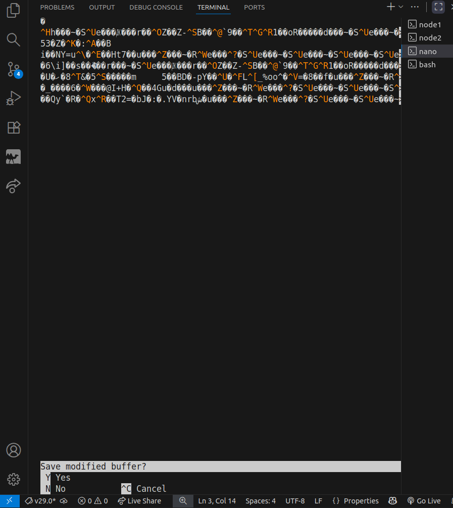
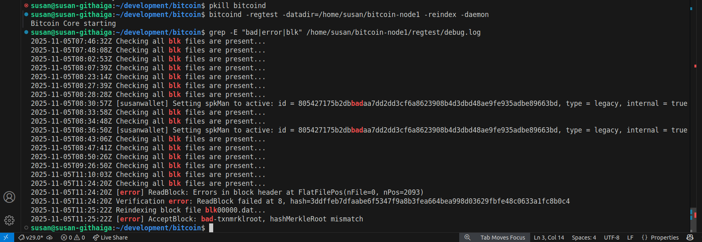

##  Observing Consensus Rules

### Step 1: Corrupt a Block (for demo only)

#### i) Copy and Corrupt a Block

```bash
mkdir -p ~/tmp
cp /home/susan/bitcoin-node1/regtest/blocks/blk00000.dat ~/tmp/
```

#### ii) Then open the copy in a hex editor or text editor and modify a random byte:
```bash
nano ~/tmp/blk00000.dat

```

*Output:*
<br>




<br>

---

### Step 2: Restart Node

#### Restart the node with *-reindex* so that Bitcoin Core re-reads all blockchain data files and rebuilds its internal database

```bash
bitcoind -regtest -datadir=/home/susan/bitcoin-node1 -reindex -daemon
```

#### Check Logs

```bash
grep "bad-blk" /home/susan/bitcoin-node1/regtest/debug.log
```


<br>

*Output:*

<br>


