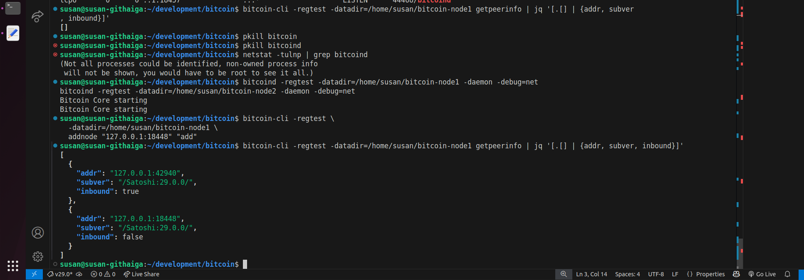
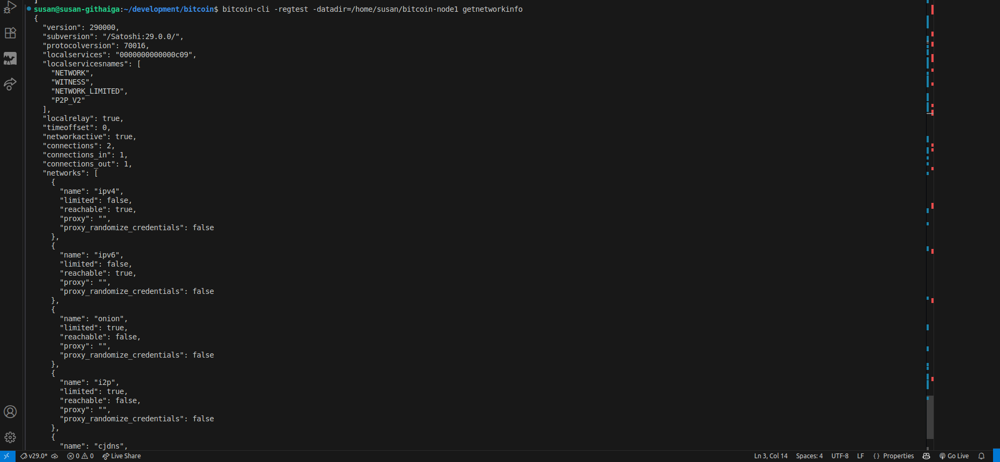

##  Visualizing Peer Connections

**Node used: node1**

### Step 1: View Network Graph

```bash
bitcoin-cli -regtest -datadir=/home/susan/bitcoin-node1 getpeerinfo | jq '[.[] | {addr, subver, inbound}]'
```
*Output:*
<br>



<br>

---

### Step 2: Use bitcoin-cli getnetworkinfo

```bash
bitcoin-cli -regtest -datadir=/home/susan/bitcoin-node1 getnetworkinfo
```

<br>

*Output:*

<br>



<br>

*Complete output:*

<br>

```bash
susan@susan-githaiga:~/development/bitcoin$ bitcoin-cli -regtest -datadir=/home/susan/bitcoin-node1 getnetworkinfo
{
  "version": 290000,
  "subversion": "/Satoshi:29.0.0/",
  "protocolversion": 70016,
  "localservices": "0000000000000c09",
  "localservicesnames": [
    "NETWORK",
    "WITNESS",
    "NETWORK_LIMITED",
    "P2P_V2"
  ],
  "localrelay": true,
  "timeoffset": 0,
  "networkactive": true,
  "connections": 2,
  "connections_in": 1,
  "connections_out": 1,
  "networks": [
    {
      "name": "ipv4",
      "limited": false,
      "reachable": true,
      "proxy": "",
      "proxy_randomize_credentials": false
    },
    {
      "name": "ipv6",
      "limited": false,
      "reachable": true,
      "proxy": "",
      "proxy_randomize_credentials": false
    },
    {
      "name": "onion",
      "limited": true,
      "reachable": false,
      "proxy": "",
      "proxy_randomize_credentials": false
    },
    {
      "name": "i2p",
      "limited": true,
      "reachable": false,
      "proxy": "",
      "proxy_randomize_credentials": false
    },
    {
      "name": "cjdns",
      "limited": true,
      "reachable": false,
      "proxy": "",
      "proxy_randomize_credentials": false
    }
  ],
  "relayfee": 0.00001000,
  "incrementalfee": 0.00001000,
  "localaddresses": [
  ],
  "warnings": [
  ]
}
```